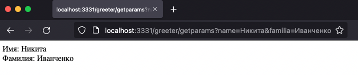
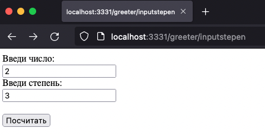
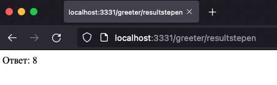
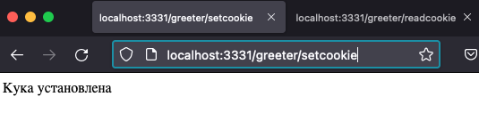
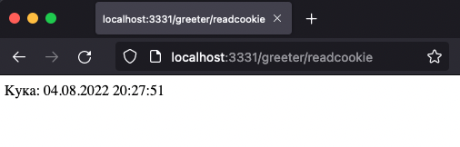
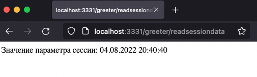
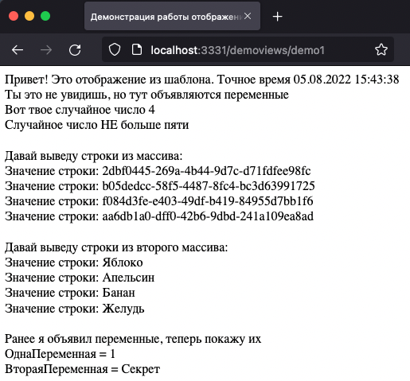

## WINOW is not OneScript.web

Минималистичный веб-сервер, построен на нативном TCPСервер, и работает на желудях. 

Зачем это нужно, когда есть OneScript.Web, -CGI и т.д.? Отвечаю - для того, что бы все было на чистом OneScript! И потому, что могу. С полным контролем, от входа двоичных данных на порт, до определения маршрута, получения данных, генерации ответа по шаблону и отправкой обратно клиенту.

## Книга жалоб и пожеланий !

Можно оставить тут https://github.com/Nivanchenko/winow/issues

## Что можно сделать ?

Данная библиотека позволит Вам достаточно просто подготовить и запустить:

- микросервис, с гибким API
- быстро сделать МОК для вашего "любимого" удаленного API и наконец-то продолжить комфортную разработку.
- Веб приложение, с отдачей статичных файлов, разграничением доступа по ролям, и генерацией страниц по шаблонам.
- И все, на что хватит фантазии.

## Какие возможности ?

В данной библиотеке я постарался реализовать подход в разработке приложений в стиле MVC. 

На текущий момент winow позволяет:

- Обрабатывать входящие GET и POST запросы.
- Обеспечивать маршрутизацию входящего запроса до нужного метода.
- Разбирать все входящие параметры.
- Обрабатывать тело входящего POST запроса.
- Работать с печеньками (Cookie). 
- Работать с сессиями.
- Отдавать статичные файлы(картинки, архивы и т.д.)
- Работать с шаблонами ответов (Синтаксис шаблона чем-то похож на jinja2, но сильно упрощен).
- Базовая авторизация и управление доступом к страницам по ролям.

## Ограничения ?

Да! Нет никаких обещаний на тему больших нагрузок. И нет поддержки https, погружаться в историю с шифрованием трафика, я еще не готов.

## Как, из чего, зависимости ?

Библиотека разработана с использованием фреймворка для инверсии зависимостей - https://github.com/nixel2007/autumn. Для более эффективной работы с winow, следует ознакомиться. А так же обязательно пройти по ссылке и поставить звездочку, без этого ничего работать не будет.

## Хеллоу ворлд !

От слов - к делу. Что бы понять, как это все работает, давайте сделаем hello-world приложение, которое будет запускаться на localhost:3331 и отвечать простым текстом hello-world. 

Первым делом, нам нужна точка входа, которая запустит приложение. 

Создадим такой файл:
```
ПриветМир.os
```

```bsl
#Использовать winow

// Создадим сервер, который будет центром мироздания.
Сервер = ФабрикаСерверов.СоздатьСервер();	

//Установим желаемый порт
Сервер.Настройки.Порт = 3331;

// В целях удобства разработки и отладки, отключим обработку запросов в ФЗ
Сервер.Настройки.ЗапросВФоновыхЗаданиях = Ложь;

// Для того, что бы сервер знал, как обрабатывать входящие запросы, в него нужно такой фунционал загрузить. Можно это сделать вот такой командой из каталога.
// Первый параметр - произвольное имя приложения, второй - каталог, в котором находятся классы, для управления логикой обработки запросов.
КонтекстПриложения = Сервер.МенеджерПриложений.ДобавитьПриложениеИзКаталога("ПриветМир", "./hwapp");

// Запуск сервера
Сервер.Старт();
```

Теперь можете запустить файл ```ПриветМир.os``` и ничего не будет работать. И причин для этого ровно две. Первая - вы не сходили https://github.com/nixel2007/autumn и не поставили звезду. Вторая - мы не создали каталог, с классами, которые обрабатывают логику запросов. Я верю, что вы успели сходить и поставить звезду! Перейдем к созданию логики.

Создаем каталог и файл:

```
hwapp/КонтролПриветствия.os
```

```bsl
&Пластилин
Перем ОбщийКонтейнер Экспорт;

&Контроллер("/")
&Желудь
Процедура ПриСозданииОбъекта()

КонецПроцедуры

&ТочкаМаршрута("/")
Процедура Приветствие(ВходящийЗапрос, Ответ, Сессия) Экспорт

	Ответ.УстановитьТипКонтента("html");

	Ответ.ТелоТекст = СтрШаблон("<!DOCTYPE html>
								|<div> %1 </div>",  "Привет новый дивный мир !");

КонецПроцедуры
```

И снова пробуем запустить ```ПриветМир.os```, и идем в http://localhost:3331/

И чудо свершилось:


## Передача параметров в строке запроса.

После продолжительного восторга, двигаемся дальше. На новом примере разберем по частям, как это работает.

Давайте сделаем еще один контроллер, еще более интерактивный. Сделаем так, что приложение будет нас встречать по имени. Имя мы хотим передавать в параметрах строки запроса.

http://localhost:3331/greeter/getparams?name=Nikita&familia=ivanchenko

Где ```greeter``` путь до нашего контроллера. И ```getparams``` точка входа для метода, который обрабатывает запрос. Все что полсе ```?``` именные параметры.

Поехали, создаем файл:

```
hwapp/ИнтерактивныйКонтролПриветствия.os
```

```bsl
&Пластилин
Перем ОбщийКонтейнер Экспорт;

&Контроллер("/greeter")
&Желудь
Процедура ПриСозданииОбъекта()

КонецПроцедуры

&ТочкаМаршрута("getparams")
Процедура Приветствие(ВходящийЗапрос, Ответ, Сессия) Экспорт

	Ответ.УстановитьТипКонтента("html");

	Имя = ВходящийЗапрос.ПараметрыИменные["name"];
	Фамилия = ВходящийЗапрос.ПараметрыИменные["familia"];

	Ответ.ТелоТекст = СтрШаблон("<!DOCTYPE html>
								|<div> Имя: %1 </div>
								|<div> Фамилия: %2 </div>",  Имя, Фамилия);

КонецПроцедуры
```

Опять запускаем ```ПриветМир.os```, и идем теперь вот так http://localhost:3331/greeter/getparams?name=Никита&familia=Иванченко



Снова полный успех! Но давайте подробней остановимся на каждом этапе этого чуда.

Файл, который мы только что сделали, описывает определенную точку в адресной строке. При совпадении с которой, перехватывается управление над входящим запросом. Посмотрим поближе.

Сначала описывается реквизит нашего класса

```bsl
&Пластилин
Перем ОбщийКонтейнер Экспорт;
```

Аннотация ```&Пластилин``` перед объявлением переменной говорит о том, что, когда будет создан наш объект - контроллер, под капотом случится натуральная магия, и в эту переменную будет установлен некий объект. Предназначение которого, мы разберем далее.

```bsl
&Контроллер("/greeter")
&Желудь
Процедура ПриСозданииОбъекта()

КонецПроцедуры
``` 

Следом идет конструктор нашего класса, ```ПриСозданииОбъекта()```. Весь код, который в нем написан, будет выполнен при создании. Удобно тут выполнять всякую инициализацию переменных. 

Этот метод имеет две аннотации ```&Желудь```, сейчас она не интересна. О ней можно почитать по ссылкам, которые я давал выше. И ```&Контроллер("/greeter")``` говорит о том, что наш контроллер перехватит управление, всего что будет в адресе запроса http://localhost:3331/greeter и после.

Стоит отметить что аннотация может быть более длинной, что бы отвечать логике описания api. Например вот так ```&Контроллер("/app/api/v1/greeter")``` тоже рабочий вариант, только ходить нужно уже вот сюда http://localhost:3331/app/api/v1/greeter

У любого контроллера может быть любое множество методов, которыми он обрабатывает входящий запрос.

```bsl
&ТочкаМаршрута("getparams")
Процедура Приветствие(ВходящийЗапрос, Ответ, Сессия) Экспорт
``` 

Для того, что бы процедура контроллера могла понимать, что ее вызывают из запроса, ее нужно пометить аннотацией ```&ТочкаМаршрута("getparams")```. Где параметр аннотации указывает имя в пути, после которого ей нужно сработать.

Так же, что бы все получилось, процедура должна отвечать нескольким требованиям:

- Быть экспортной
- Принимать на вход три параметра ```ВходящийЗапрос, Ответ, Сессия```. Назначение которых мы разберем по ходу дела.

```ВходящийЗапрос``` Например хранит всю информацию, которая пришла к нам от клиента. В том числе ```ВходящийЗапрос.ПараметрыИменные``` - соответствие, хранящее значения всех параметров, которые переданы после знака ```?```

Дальше мы лихо эти параметры читаем.

```bsl
Имя = ВходящийЗапрос.ПараметрыИменные["name"];
Фамилия = ВходящийЗапрос.ПараметрыИменные["familia"];
``` 

Следующий параметр ```Ответ```, в котором собирается все, что будет отправлено обратно клиенту. Например - вот так

```bsl
Ответ.УстановитьТипКонтента("html");
``` 

Устанавливается заголовок ```Content-Type```, благодаря которому браузер понимает, как отобразить то, что мы ему шлем.

По умолчанию поддерживаются типы:

```bsl
ОписанияТиповРасширений = Новый Соответствие();
ОписанияТиповРасширений.Вставить("htm","text/html; charset=utf-8");
ОписанияТиповРасширений.Вставить("html","text/html; charset=utf-8");
ОписанияТиповРасширений.Вставить("css","text/css");
ОписанияТиповРасширений.Вставить("js","text/javascript");
ОписанияТиповРасширений.Вставить("jpg","image/jpeg");
ОписанияТиповРасширений.Вставить("jpeg","image/jpeg");
ОписанияТиповРасширений.Вставить("png","image/png");
ОписанияТиповРасширений.Вставить("gif","image/gif");
ОписанияТиповРасширений.Вставить("ico","image/x-icon");
ОписанияТиповРасширений.Вставить("zip","application/x-compressed");
ОписанияТиповРасширений.Вставить("rar","application/x-compressed");
ОписанияТиповРасширений.Вставить("json","application/json");
ОписанияТиповРасширений.Вставить("txt","text/plain; charset=utf-8");
``` 

Ну и конечно же устанавливаем текст ответа, который вернется клиенту. 

```bsl
Ответ.ТелоТекст = СтрШаблон("<!DOCTYPE html>
                            |<div> Имя: %1 </div>
                            |<div> Фамилия: %2 </div>",  Имя, Фамилия);
``` 

Сейчас это не удобно и не красиво. Но к концу нашей беседы мы разберемся - как сделать красиво.

## Еще один способ передачи параметров в строке запроса. 

Предыдущий пример показал, как можно передать параметры в строке запроса, при этом параметры имели имена. Теперь рассмотрим пример, когда параметры упорядоченные.

Давайте сделаем наконец калькулятор! И будет он работать вот так:

```
http://localhost:3331/greeter/calc/<operation>/<first>/<second>/
```
Где ```calc``` - точка маршрута. ```operation``` - вид операции, будем поддерживать minus и plus. и следом два слагаемых нашего уравнения.

Добавим в наш

```
hwapp/ИнтерактивныйКонтролПриветствия.os
```

новую точку маршрута:

```bsl
&ТочкаМаршрута("calc")
Процедура Калькулятор(ВходящийЗапрос, Ответ, Сессия) Экспорт

	Ответ.УстановитьТипКонтента("html");

	Если ВходящийЗапрос.ПараметрыПорядковые.Количество() <> 3 Тогда

		Решение = "Неверное число параметров";

	ИначеЕсли Не (ВходящийЗапрос.ПараметрыПорядковые[0] = "minus" 
				ИЛИ	ВходящийЗапрос.ПараметрыПорядковые[0] = "plus") Тогда
		Решение = "Операция не распознана";

	Иначе
		Попытка
			Число1 = Число(ВходящийЗапрос.ПараметрыПорядковые[1]);
			Число2 = Число(ВходящийЗапрос.ПараметрыПорядковые[2]);

			Если ВходящийЗапрос.ПараметрыПорядковые[0] = "minus" Тогда
				Решение = Число1 - Число2;
			Иначе
				Решение = Число1 + Число2;
			КонецЕсли

		Исключение
			Решение = "Ошибка конвертации в число"
		КонецПопытки;
	КонецЕсли;

	Ответ.ТелоТекст = СтрШаблон("<!DOCTYPE html>
								|<div> Ответ: %1 </div>",  Решение);

КонецПроцедуры
``` 

Перезапустим приложение, и перейдем по ссылке http://localhost:3331/greeter/calc/plus/3/2

И в ответ перед нами будет красоваться 


На самом деле, тут все очень просто. Когда мы объявляем точку маршрута ```&ТочкаМаршрута("calc")```, все что дальше в пути через ```/``` будет любезно складываться в массив ```ВходящийЗапрос.ПараметрыПорядковые```. А что делать с массивами, вы и без меня знаете.

## Входящие POST запросы

С пост запросами, все почти так же просто. ```ВходящийЗапрос``` Имеет два поля ```Тело``` и ```ТелоДвоичныеДанные```, т.к. пользователь может закинуть нам как текст, так и картинку например. 

Давайте потренируемся в обработке таких запросов, усовершенствуем наше приложение и научим его возводить в степень переданное число. 

Вводить число мы будем по адресу http://localhost:3331/greeter/inputstepen, где будет форма ввода числа, и кнопка расчета. После расчета мы будем перенаправлены на http://localhost:3331/greeter/resultstepen. Форма будет передавать параметры методом POST.

Для реализации этой задумки добавим в наш

```
hwapp/ИнтерактивныйКонтролПриветствия.os
```

этот код, с двумя новыми точками маршрута

```bsl
&ТочкаМаршрута("inputstepen")
Процедура ВводСтепени(ВходящийЗапрос, Ответ, Сессия) Экспорт

	Ответ.УстановитьТипКонтента("html");

	Ответ.ТелоТекст = 
	"<form method=""post"" action=""/greeter/resultstepen"">
	|<label for=""chislo"">Введи число:</label><br>
	|<input type=""text"" id=""chislo"" name=""chislo""><br>
	|<label for=""stepen"">Введи степень:</label><br>
	|<input type=""text"" id=""stepen"" name=""stepen""><br><br>
	|<input type=""submit"" value=""Посчитать"">
	|</form> ";

КонецПроцедуры

&ТочкаМаршрута("resultstepen")
Процедура ВозводительВСтепень(ВходящийЗапрос, Ответ, Сессия) Экспорт

	Ответ.УстановитьТипКонтента("html");

	ПостПараметры = ОбщийКонтейнер.Парсеры.ПараметрыИзТекста(ВходящийЗапрос.Тело);

	Попытка
		Решение = Pow(ПостПараметры["chislo"], ПостПараметры["stepen"]);	
	Исключение
		Решение = "Ошибка при расчетах " + ОписаниеОшибки();
	КонецПопытки;

	Ответ.ТелоТекст = СтрШаблон("<!DOCTYPE html>
								|<div> Ответ: %1 </div>",  Решение);

КонецПроцедуры
``` 





Теперь разберемся, что тут произошло. Не буду останавливаться на описании HTML тегов, для этого в интернете сайтов больше, чем звезд на небе. 

Точка маршрута ```inputstepen``` показала нам форму, которая при расчете перенаправляет нас на ```resultstepen``` и в теле запроса передает параметры формы, которые имеют вид ```chislo=2&stepen=3```. Все что нам осталось, это обработать запрос.

Мы можем парсить самостоятельно, но объект ```ОбщийКонтейнер```, который мы внедрили ранее, имеет объект, который умеет парсить параметры в таком формате ```Парсеры.ПараметрыИзТекста(<СтрокаСПараметрами>)```. Этот метод вернет соответствие со значениями, которые в последствии нужно правильно использовать.

## Работа с куками

Куки, это возможность сохранить на клиенте, в браузере, какую-либо информацию. 

Объекты ```ВходящийЗапрос``` и ```Ответ```, которые мы получаем в метод, который мы помечаем как ```ТочкаМаршрута```. Оба этих объекта имеют свойство ```Куки```. Соответственно во входящем запросе их можно читать, а в ответе устанавливать.

Модернизируем файл

```
hwapp/ИнтерактивныйКонтролПриветствия.os
```

```bsl
&ТочкаМаршрута("setcookie")
Процедура УстановитьКуку(ВходящийЗапрос, Ответ, Сессия) Экспорт

	Ответ.УстановитьТипКонтента("html");

	ИмяКуки = "ДатаПоследнегоВхода";
	ЗначениеКуки = ТекущаяДата();

	НоваяКука = Ответ.Куки.Добавить(ИмяКуки, ЗначениеКуки);

	Ответ.ТелоТекст = "<!DOCTYPE html>
						|<div> Кука установлена </div>";

КонецПроцедуры

&ТочкаМаршрута("readcookie")
Процедура ПрочитатьКуку(ВходящийЗапрос, Ответ, Сессия) Экспорт

	Ответ.УстановитьТипКонтента("html");

	ИмяКуки = "ДатаПоследнегоВхода";

	ЗначениеКуки = ВходящийЗапрос.Куки.ПолучитьЗначениеПоИмени(ИмяКуки);

	Ответ.ТелоТекст = СтрШаблон("<!DOCTYPE html>
								|<div> Кука: %1 </div>", ЗначениеКуки);

КонецПроцедуры
``` 





Еще раз, не забываем, что куки хранятся на стороне браузера.

## Хранение данных сессии

Третий параметр точки маршрута ```Сессия``` имеет поле ```Данные```. По сути, это соответствие, в которое можно записывать и читать любые значения. Эти данные хранятся на сервере, пока он работает. При остановке, денные сессии пропадают. При необходимости, в рамках приложения, можно дописать хранение данных сессии в файлах, базах данных и т.д.

Еще один пример

```
hwapp/ИнтерактивныйКонтролПриветствия.os
```

```bsl
&ТочкаМаршрута("setsessiondata")
Процедура УстановитьДанныеСессии(ВходящийЗапрос, Ответ, Сессия) Экспорт

	Ответ.УстановитьТипКонтента("html");

	ИмяПараметраСессии = "ДатаПоследнегоВхода";
	ЗначениеПараметраСессии  = ТекущаяДата();

	
	Сессия.Данные[ИмяПараметраСессии] = ЗначениеПараметраСессии;

	Ответ.ТелоТекст = "<!DOCTYPE html>
						|<div> Данные сессии установлены </div>";

КонецПроцедуры

&ТочкаМаршрута("readsessiondata")
Процедура ПрочитатьДанныеСессии(ВходящийЗапрос, Ответ, Сессия) Экспорт

	Ответ.УстановитьТипКонтента("html");

	ИмяПараметраСессии = "ДатаПоследнегоВхода";
	ЗначениеПараметраСессии  = Сессия.Данные[ИмяПараметраСессии];

	Ответ.ТелоТекст = СтрШаблон("<!DOCTYPE html>
								|<div> Значение параметра сессии: %1 </div>", ЗначениеПараметраСессии);

КонецПроцедуры
``` 




## Публикация статичных файлов.

Часто нужно открывать доступ для скачивания всевозможных файлов. Таких как картинки, js-скрипты, css и т.д.

Для этого у менеджера приложений есть специальный метод ```Сервер.МенеджерПриложений.ДобавитьКаталогСтатичныхФайлов(<Каталог на диске>, <Путь на сайте>);```

Давайте попробуем сделать наше приложение повеселее и добавить картинок.

Добавим в каталог приложения пару картинок.

```
hwapp/files/zl1.jpg
hwapp/files/fun/zl2.jpg
```

Подключим этот каталог с файлами

```
ПриветМир.os
```

```bsl
#Использовать winow

Сервер = ФабрикаСерверов.СоздатьСервер();	

Сервер.Настройки.Порт = 3331;

Сервер.Настройки.ЗапросВФоновыхЗаданиях = Ложь;

КонтекстПриложения = Сервер.МенеджерПриложений.ДобавитьПриложениеИзКаталога("ПриветМир", "./hwapp");

// Добавляем каталог, так что бы файлы были доступны по пути /images
Сервер.МенеджерПриложений.ДобавитьКаталогСтатичныхФайлов("./hwapp/files", "/images");

Сервер.Старт();
```

Данный метод можно вызвать несколько раз, и "примонтировать" разные физические каталоги, в разные места приложения.

```bsl
Сервер.МенеджерПриложений.ДобавитьКаталогСтатичныхФайлов("./hwapp/catsfoto", "/kotiki");
Сервер.МенеджерПриложений.ДобавитьКаталогСтатичныхФайлов("./hwapp/dogsfoto", "/sobachki");
``` 


Как видим, по заданному пути теперь доступны файлы из каталога, при чем с сохранением внутренней иерархии каталога файлов.

Стоит отметить, что доступны становятся не все файлы сразу, а только те, расширения которых описаны в соответствии

```bsl
ОписанияТиповРасширений = Новый Соответствие();
ОписанияТиповРасширений.Вставить("htm","text/html; charset=utf-8");
ОписанияТиповРасширений.Вставить("html","text/html; charset=utf-8");
ОписанияТиповРасширений.Вставить("css","text/css");
ОписанияТиповРасширений.Вставить("js","text/javascript");
ОписанияТиповРасширений.Вставить("jpg","image/jpeg");
ОписанияТиповРасширений.Вставить("jpeg","image/jpeg");
ОписанияТиповРасширений.Вставить("png","image/png");
ОписанияТиповРасширений.Вставить("gif","image/gif");
ОписанияТиповРасширений.Вставить("ico","image/x-icon");
ОписанияТиповРасширений.Вставить("zip","application/x-compressed");
ОписанияТиповРасширений.Вставить("rar","application/x-compressed");
ОписанияТиповРасширений.Вставить("json","application/json");
ОписанияТиповРасширений.Вставить("txt","text/plain; charset=utf-8");
``` 

При желании этот список можно расширить.

## Работа с шаблонами страниц.

Если вы дочитали до этого пункта, я в первую очередь Вам благодарен. И в знак уважения, расскажу про механизм шаблонов. Я ведь раньше гордо заявил, что тут возможен подход MVC, так вот вы, наверное, все время задавались вопросом, где же V? И правда, писать код так:

```bsl
Ответ.ТелоТекст = СтрШаблон("<!DOCTYPE html>
							|<div> Имя: %1 </div>
							|<div> Фамилия: %2 </div>",  Имя, Фамилия);
``` 

просто не удобно, и мало приличных слов для такого подхода можно подобрать, и ни в одном не будет буквы V. Но у меня есть решение!

Сразу покажу пример, а потом разберем по строчкам. Давайте отобразим страницу, на которой выведем текущее время, совершенно псевдо-случайное число, динамически выведем случайное количество строк, и попробуем поиграться с условиями.

Поехали!

```
hwapp/ИнтерактивныйКонтролПриветствия.os
```

```bsl
&Пластилин
Перем ОбщийКонтейнер Экспорт;

&Контроллер("/demoviews")
&Желудь
Процедура ПриСозданииОбъекта()

КонецПроцедуры

&Отображение("./hwapp/view/view1.html")
&ТочкаМаршрута("demo1")
Процедура ДемонстрацияОтображения(ВходящийЗапрос, Ответ, Сессия) Экспорт

	Ответ.УстановитьТипКонтента("html");

	ГСЧ = Новый ГенераторСлучайныхЧисел();
	
	СлучайноеЧисло = ГСЧ.СлучайноеЧисло(1, 10);

	Массив = Новый Массив();

	Для Сч = 1 по СлучайноеЧисло Цикл
		Массив.Добавить(Строка(Новый УникальныйИдентификатор()));
	КонецЦикла;

	Модель = Новый Структура();
	Модель.Вставить("СлучайноеЧисло", СлучайноеЧисло);
	Модель.Вставить("МассивСтрок", Массив);

	Ответ.Модель = Модель;

КонецПроцедуры
``` 

Что тут нового? Во первых у точки маршрута появилась аннотация ```&Отображение("./hwapp/view/view1.html")```. А во вторых - определяется структура и устанавливается в ```Ответ.Модель```. В этом весь секрет. После работы метода, на сцену выходит шаблонизатор, найдет указанные шаблон и разложит данные из модели, в соответствии с разметкой.

```
hwapp/view/view1.html
```

```html
<!doctype html>
    <html>
    <head>
    <title>Демонстрация работы отображений</title>
   </head>
    <body>
   
    
    <div>Привет! Это отображение из шаблона. Точное время {{ ТекущаяДата() }} 
        <br>
        <div>Ты это не увидишь, но тут объявляются переменные</div>
            
    </div>
    <div> Вот твое случайное число {{ Модель.СлучайноеЧисло }} </div>

    

        <div>Случайное число БОЛЬШЕ пяти</div>

    

        <div>Случайное число НЕ больше пяти</div>

    

    <div>Давай выведу строки из массива:</div>

    

        <div>Значение строки: {{ СтрокаИзМассива }} и оно достаточно случайно</div>

    

    <div>Ранее я объявил переменные, теперь покажу их</div>
    <div>ОднаПеременная = {{ ОднаПеременная }}</div>
    <div>ВтораяПеременная = {{ ВтораяПеременная }}</div>

    </body>
    </html>
``` 

Если присмотреться, то шаблон это просто HTML разметка, которую смешали с 1сным кодом. Вот это коктель получился!

Основные принципы разметки:

Выражения - обозначаются тегами. ```{{ <Выражение> }}```. Тут может быть: 

- Любое выражение на 1С, которое возвращает значение ```{{ 1 + 3 }}```
- Переменная ```{{ Модель.ЛюбоеЗначение }}```
- Функция ```{{ Макс(1,5,9,7) }}```

Операторы - обозначаются тегами. ``````.

Это полноценный код на 1С. Можно объявлять переменные, взаимодействовать с ```Модель```, использовать управляющие блоки(Циклы, Условия)


## Компоненты. 

Писать шаблоны круто, но что может быть еще круче? Писать меньше шаблонов, и переиспользовать уже имеющиеся. Представим, что вам в разных местах нужно отображают одну и туже информацию, (таблицы, элементы меню, и т.д.). для решения этой задачи, шаблон имеет секретную функцию ```{{ ВывестиПоШаблону(<Путь до шаблона>, <Модель для шаблона>) }}```

Давайте покажу как это работает

```
hwapp/ИнтерактивныйКонтролПриветствия.os
```

```bsl
&Отображение("./hwapp/view/view1.html")
&ТочкаМаршрута("demo1")
Процедура ДемонстрацияОтображения(ВходящийЗапрос, Ответ, Сессия) Экспорт

	Ответ.УстановитьТипКонтента("html");

	ГСЧ = Новый ГенераторСлучайныхЧисел();
	
	СлучайноеЧисло = ГСЧ.СлучайноеЧисло(1, 10);

	Массив = Новый Массив();

	Для Сч = 1 по СлучайноеЧисло Цикл
		Массив.Добавить(Строка(Новый УникальныйИдентификатор()));
	КонецЦикла;

	Модель = Новый Структура();
	Модель.Вставить("СлучайноеЧисло", СлучайноеЧисло);
	Модель.Вставить("МассивСтрок", Массив);

	// добавим в модель второй массив
	МассивФруктов = Новый Массив();
	МассивФруктов.Добавить("Яблоко");
	МассивФруктов.Добавить("Апельсин");
	МассивФруктов.Добавить("Банан");
	МассивФруктов.Добавить("Желудь");

	Модель.Вставить("ВторойМассив", МассивФруктов);

	Ответ.Модель = Модель;

КонецПроцедуры
``` 

Шаблоны:

```
hwapp/view/view1.html
```

```html
    <!doctype html>
    <html>
    <head>
    <title>Демонстрация работы отображений</title>
   </head>
    <body>
   
    
    <div>Привет! Это отображение из шаблона. Точное время {{ ТекущаяДата() }} 
        <br>
        <div>Ты это не увидишь, но тут объявляются переменные</div>
            
    </div>
    <div> Вот твое случайное число {{ Модель.СлучайноеЧисло }} </div>

    

        <div>Случайное число БОЛЬШЕ пяти</div>

    

        <div>Случайное число НЕ больше пяти</div>

    

    <br>
    <div>Давай выведу строки из массива:</div>

    {{ ВывестиПоШаблону("./hwapp/view/printarray.html", Модель.МассивСтрок) }}
    
    <br>
    <div>Давай выведу строки из второго массива:</div>

    {{ ВывестиПоШаблону("./hwapp/view/printarray.html", Модель.ВторойМассив) }}

    <br>
    <div>Ранее я объявил переменные, теперь покажу их</div>
    <div>ОднаПеременная = {{ ОднаПеременная }}</div>
    <div>ВтораяПеременная = {{ ВтораяПеременная }}</div>

    </body>
    </html>
```

```
hwapp/view/printarray.html
```

```html
<div>


    <div>Значение строки: {{ СтрокаИзМассива }}</div>


</div>
```



# Ответы по ошибкам.

Обрабатывая входящие запросы, могут случиться исключения. Ну кто с первого раза напишет правильно код? Сервер при исключении вернет страницу с кодом 500. Шаблон этой страницы можно переопределить. Моделью там будет структура

```bsl
Ответ.Модель = Новый Структура();
Ответ.Модель.Вставить("КодСостояния", 500);
Ответ.Модель.Вставить("ТекстСообщения", ТекстОшибки);
Ответ.Модель.Вставить("Запрос", Запрос);
```

Ну а какой пользователь с первого раза введет без ошибки адрес ресурса? Сервер вернет ему 404. Шаблон этой ошибки так же можно переопределить. Модель там следующая

```bsl
Ответ.Модель = Новый Структура();
Ответ.Модель.Вставить("КодСостояния", 404);
Ответ.Модель.Вставить("ТекстСообщения", "Страница не найдена");
Ответ.Модель.Вставить("Запрос", Запрос);
```

А вот таким не замысловатым способом можно переопределить шаблон стандартной ошибки

```bsl
Сервер = ФабрикаСерверов.СоздатьСервер();	
Сервер.Настройки.Порт = 3331;
Сервер.Настройки.ЗапросВФоновыхЗаданиях = Ложь;
// Переопределяю текст шаблона ошибки 404.
Сервер.УстановитьШаблон404("<!DOCTYPE html>
							|<div><h1> {{ Модель.КодСостояния }} </h1></div>
							|<div> {{ Модель.ТекстСообщения }} </div>
							|<div> Искомый ресурс {{ Модель.Запрос.Путь }} не найден </div>");
```

# Перенаправление

Иногда бывает так, что нужно с одной страницы, перенаправить позльзователя на другую.

Для этого, у объекта ```Ответ``` есть метод ```Перенаправить(<Адрес куда перенаправить>)```. Например подобная точка маршрута будет перенаправлять запрос в корень приложения

```bsl
&ТочкаМаршрута("/redir")
Процедура Перенаправление(ВходящийЗапрос, Ответ, Сессия) Экспорт
	Ответ.Перенаправить("/");
КонецПроцедуры
```

# Загрузка настроек из файла

Настройки порта, имени хоста, обработки в фоновых заданиях, каталогов файлов и приложений можно можно хранить в json файле, и загружать при старте приложения.

```bsl
Сервер = ФабрикаСерверов.СоздатьСервер();
Сервер.Настройки.ПрочитатьИзФайла("./.hwapp.json");	
Сервер.Старт();
```

```json
{
    "Порт": 3331,
    "ИмяХоста": "localhost",
    "ЗапросВФоновыхЗаданиях": false,
    "КаталогиСПриложениями": {
        "ПриветМир": "./hwapp"
    },
    "КаталогиСФайлами": {
        "/images": "./hwapp/files"
    }
}
```

При попытке прочитать не существующий файл настроек, будет вызвано исключение и сформирован по указанному пути новый файл. Этот файл будет содержать настройки по умолнчанию, которые можно отредактировать.

# Управление доступом

Для управления доступом к точке маршрута, предусмотрена аннотация ```&Роли("<Список ролей через запятую>")```. Все очень просто, и остается ответить только на один вопрос - как эти роли раздать, и как хранить данные входа пользователей. Пока это mvp, точного ответа не дам. Разработчик может самостоятельно придумать, как и где хранить группы и пароли. Я только покажу как их подключить в наше приложение.

```
hwapp/КонтролСУправлениемДоступом.os
```

```bsl
&Пластилин
Перем ОбщийКонтейнер Экспорт;

&Контроллер("/sec")
&Желудь
Процедура ПриСозданииОбъекта()
	
КонецПроцедуры

&ФинальныйШтрих
Процедура ПроинициализироватьРоли() Экспорт 
	
	// Инициализация данных входа "пользователей"
	ОбщийКонтейнер.МенеджерДоступа.ДобавитьТокен("Админ", "123");	
	ОбщийКонтейнер.МенеджерДоступа.ДобавитьТокен("Пользователь", "111");

	// Назначение ролей "пользователям"
	ОбщийКонтейнер.МенеджерДоступа.ДобавитьРольЛогина("Админ", "Администраторы");
	ОбщийКонтейнер.МенеджерДоступа.ДобавитьРольЛогина("Админ", "Пользователи");

	ОбщийКонтейнер.МенеджерДоступа.ДобавитьРольЛогина("Пользователь", "Пользователи");
КонецПроцедуры

// Точка доступная роли пользователи
&Роли("Пользователи")
&ТочкаМаршрута("user")
Процедура Пользователь(ВходящийЗапрос, Ответ, Сессия) Экспорт
	Ответ.ТелоТекст = "Пользователи";
КонецПроцедуры

// Точка доступная роли Администраторы
&Роли("Администраторы")
&ТочкаМаршрута("admin")
Процедура Админ(ВходящийЗапрос, Ответ, Сессия) Экспорт
	Ответ.ТелоТекст = "Админка";
КонецПроцедуры

// обычная точка, доступная всем
&ТочкаМаршрута("free")
Процедура Все(ВходящийЗапрос, Ответ, Сессия) Экспорт
	Ответ.ТелоТекст = "Все подрят";
КонецПроцедуры

// Точка доступная ролям администраторы, пользователи.
&Роли("Администраторы, Пользователи")
&ТочкаМаршрута("usradm")
Процедура АдминыИПользователи(ВходящийЗапрос, Ответ, Сессия) Экспорт
	Ответ.ТелоТекст = "Админы и пользователи";
КонецПроцедуры
```